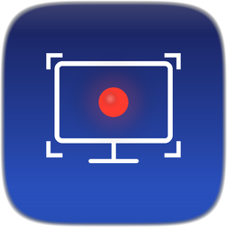

<p align="center">
  
</p>

<h1 align="center">Zureshot</h1>

<p align="center">
  <strong>Pixel-perfect screen recording for Mac & Linux.</strong><br>
  Built with Rust. Powered by native APIs.
</p>

<p align="center">
  
  
  
  
  
</p>

<p align="center">
  <a href="README.md">English</a> · <a href="README.zh-CN.md">简体中文</a> · <a href="#wechat">💬 WeChat</a>
</p>

---

## Why Zureshot?

> **Z**ero-copy · p**ure** Rust · one **shot**

The name says it all — **Zero + Pure + Shot**.

**Zero** — zero-copy GPU pipeline. The CPU never touches a single pixel. 3% usage while recording.
**Pure** — pure Rust, no Electron bloat. 3.9 MB installer, 11 MB on disk. Nothing wasted.
**Shot** — one shot, instant capture. Click to record, done.

Most screen recorders treat your Mac like a 2015 laptop — copying pixels through CPU, bloating memory, spinning fans.

**Zureshot doesn't touch your pixels.** Every frame flows through a pure GPU pipeline, from capture to file. The result: recordings that look exactly like your screen, using almost no resources.

---

## ✨ Core Technology

### 🎯 True Retina Recording

Your Mac renders at 2× or 3× physical pixels. Most tools quietly downscale to save bandwidth. **Zureshot records every single physical pixel.**

> A 3200×2132 Retina display records at 3200×2132. Not 1600×1066. No exceptions.

Text stays razor-sharp. UI elements keep their crisp edges. What you see is what you get — pixel for pixel.

### 🚀 Zero-Copy GPU Pipeline

The entire recording path lives on the GPU. Pixel data **never enters your app's memory**.

```
ScreenCaptureKit → IOSurface (GPU) → VideoToolbox HEVC → MP4
                          ↑                    ↑
                    Zero CPU copy        Hardware encoder
```

- **ScreenCaptureKit** captures frames as GPU-resident IOSurfaces
- **VideoToolbox** hardware-encodes directly from those surfaces
- **AVAssetWriter** muxes the encoded NALUs into MP4

No `memcpy`. No `Vec<u8>`. No frame buffers in RAM. The CPU barely knows a recording is happening.

### 🧊 Absurdly Low Resource Usage

| Metric | Zureshot | Typical Screen Recorder |
|--------|----------|------------------------|
| Extra RAM during recording | **~30-50 MB** | 200-500 MB |
| CPU usage | **< 3%** | 15-40% |
| GPU overhead | **< 5%** | 10-25% |
| Fan noise | **Silent** | Often audible |

Your Mac stays cool. Your battery lasts longer. Your other apps don't stutter.

### 🎨 Color-Accurate Output

Every recording is tagged with the full **BT.709 color pipeline**:

- **Color Primaries**: ITU-R BT.709 — matches sRGB displays
- **Transfer Function**: BT.709 — correct gamma curve
- **YCbCr Matrix**: BT.709 — precise luma/chroma separation
- **Capture Color Space**: sRGB — no implicit P3→709 conversion

Play your recording on any device and the colors will match your screen exactly.

### ⚡ HEVC (H.265) Hardware Encoding

Zureshot uses **HEVC Main profile** with Apple Silicon's dedicated media engine:

- **40-50% smaller** files than H.264 at equal quality
- **Adaptive bitrate** — up to 36 Mbps for 4K, tuned for screen content
- **Quality-targeted VBR** — encoder prioritizes text sharpness over file size
- **No frame reordering** — minimal latency, instant stop
- **2-second keyframes** — smooth seeking in any player

A 60-second Retina recording at 60fps: **~135 MB** (vs 200+ MB with H.264).

---

## 🎬 Features

- **📹 Full Screen Recording** — native Retina resolution, one click from tray
- **🔲 Region Recording** — drag to select any area, pixel-perfect cropping
- **⏸ Pause / Resume** — zero-overhead atomic flag, no encoding gaps
- **🔊 System Audio** — capture app sounds via ScreenCaptureKit
- **🎤 Microphone** — separate AAC track, hardware-encoded
- **🖱 Cursor Capture** — rendered by macOS compositor, zero CPU cost
- **🎯 Window Exclusion** — automatically hides Zureshot's own UI from recordings
- **⌨️ Keyboard Shortcuts** — `⌘⇧R` to record, `⌘⇧A` for region select
- **🌗 Quality Presets** — Standard (30fps) and High (60fps)
- **🐧 Linux Support** — Ubuntu 24.04+, XDG Portal + GStreamer pipeline (beta)

---

## 🏗 Architecture

### System Overview

```
┌─────────────────────────────────────────────────────────────────────┐
│                           Zureshot                                  │
├─────────────────┬───────────────────────────────────────────────────┤
│   UI Layer      │              Engine (Rust)                        │
│   Svelte 5      │                                                   │
│   (100% shared) │  ┌──────────────────────────────────────────────┐ │
│                 │  │         Platform Abstraction                 │ │
│  Tray Menu      │  │        platform/mod.rs                       │ │
│  Region Select  │  │                                              │ │
│  Recording Bar  │  │  ┌─── macOS ────┐   ┌──── Linux ────────┐   │ │
│  Dim Overlay    │  │  │ SCK→IOSurf→  │   │ XDG Portal→       │   │ │
│  Screenshot     │  │  │ VideoToolbox │   │ PipeWire→GStreamer │   │ │
│  Preview        │  │  │ →HEVC→MP4    │   │ →x264→MP4          │   │ │
│                 │  │  └──────────────┘   └────────────────────┘   │ │
│                 │  └──────────────────────────────────────────────┘ │
│                 │                                                   │
│                 │  ┌──────────┐ ┌──────────┐ ┌────────────────┐    │
│                 │  │ commands │ │   tray   │ │     lib        │    │
│                 │  │   .rs    │ │   .rs    │ │     .rs        │    │
│                 │  │ IPC cmds │ │ menus    │ │ bootstrap      │    │
│                 │  └──────────┘ └──────────┘ └────────────────┘    │
├─────────────────┴───────────────────────────────────────────────────┤
│                         Tauri v2                                    │
├──────────────────────────────┬──────────────────────────────────────┤
│  macOS: ScreenCaptureKit     │  Linux: XDG Portal + GStreamer      │
│  VideoToolbox + AVFoundation │  PipeWire + x264 + ffmpeg           │
│  objc2 FFI                   │  Subprocess pipeline (zero crates)  │
└──────────────────────────────┴──────────────────────────────────────┘
```

### Data Flow — Zero-Copy Path

```
                              Apple Silicon SoC
                    ┌───────────────────────────────┐
                    │                               │
  Display Output ───┤  Window Server composites     │
                    │  frame into IOSurface         │
                    │         │                     │
                    │         ▼                     │
                    │  ScreenCaptureKit delivers    │
                    │  CMSampleBuffer (IOSurface    │
                    │  handle — NOT pixel data)     │
                    │         │                     │
                    │         ▼                     │
                    │  VideoToolbox reads IOSurface │
                    │  via Apple Media Engine       │
                    │  (dedicated HEVC hardware)    │
                    │         │                     │
                    │         ▼                     │
                    │  Encoded H.265 NALUs          │
                    │  (tiny compressed packets)    │
                    │                               │
                    └───────────┬───────────────────┘
                                │
                                ▼
                    AVAssetWriter → MP4 file on disk
```

**Key insight**: The pixel data (e.g., 3200×2132 × 1.5 bytes/pixel = ~10 MB/frame) stays entirely in unified GPU memory. Only the tiny compressed NALUs (~50-100 KB/frame) pass through CPU memory on the way to disk.

### Data Flow — Linux (GStreamer Pipeline)

```
  User clicks Record
        │
        ▼
  XDG Desktop Portal (D-Bus)
    └─ CreateSession → SelectSources → Start
    └─ User confirms screen/window in system dialog
    └─ Returns PipeWire node_id
        │
        ▼
  gst-launch-1.0 subprocess
    └─ pipewiresrc (captures PipeWire stream)
    └─ videoconvert → videoscale → videocrop
    └─ x264enc (H.264 software encoding)
    └─ mp4mux → filesink (MP4 output)
    └─ (optional) pulsesrc → audioconvert → faac
        │
        ▼
  Pause: SIGINT → EOS → save segment
  Resume: new gst-launch process → new segment
  Stop: ffmpeg concat → final MP4
```

> **Note**: Linux currently uses software H.264 encoding. Hardware-accelerated encoding (VA-API/NVENC, HEVC) is planned for v0.6.0.

### Source Files

| File | Lines | Responsibility |
|------|-------|----------------|
| `platform/mod.rs` | ~56 | Platform abstraction: shared types, conditional compilation |
| `platform/macos/mod.rs` | ~340 | macOS RecordingHandle, lifecycle, system integration |
| `platform/macos/capture.rs` | ~650 | SCK stream, SCStreamOutput delegate, frame routing, PTS |
| `platform/macos/writer.rs` | ~470 | AVAssetWriter, HEVC encoding, BT.709, finalization |
| `platform/linux/mod.rs` | ~430 | Linux RecordingHandle, lifecycle, system integration |
| `platform/linux/portal.rs` | ~315 | XDG Desktop Portal ScreenCast (D-Bus via Python) |
| `platform/linux/writer.rs` | ~360 | GStreamer pipeline management (gst-launch subprocess) |
| `platform/linux/capture.rs` | ~90 | Screenshot (gnome-screenshot / grim) |
| `commands.rs` | ~940 | Tauri IPC commands, recording state machine, window management |
| `tray.rs` | ~520 | System tray, menus, autostart, update check |
| `lib.rs` | ~70 | App bootstrap, plugin registration |

**Rust** handles all capture, encoding, and file I/O. The UI is a thin Svelte layer (~5 components) for tray menus, region selection, and recording controls. Tauri v2 bridges the two with type-safe IPC.

### Tech Stack

| Layer | macOS | Linux |
|-------|-------|-------|
| Capture | ScreenCaptureKit (GPU zero-copy) | XDG Desktop Portal + PipeWire |
| Encoding | VideoToolbox HEVC (hardware) | x264 H.264 (software, VA-API planned) |
| Container | AVAssetWriter → MP4 | GStreamer mp4mux → MP4 |
| Audio | ScreenCaptureKit AAC | PulseAudio + GStreamer AAC |
| Screenshots | CGWindowListCreateImage | gnome-screenshot / grim |
| FFI | objc2 0.6 + block2 0.6 | Subprocess (zero native crates) |
| Dialogs | osascript (AppleScript) | zenity / kdialog |
| App Shell | Tauri v2 | Tauri v2 |
| Frontend | Svelte 5 + Vite (100% shared) | Svelte 5 + Vite (100% shared) |

---

## 🚀 Quick Start

### macOS

```bash
# Prerequisites: Rust, Node.js, pnpm
git clone https://github.com/anxiong2025/zureshot.git
cd zureshot
pnpm install
pnpm tauri dev
```

> **First launch**: macOS will ask for Screen Recording permission. Grant it in **System Settings → Privacy & Security → Screen Recording**, then restart the app.

### Linux (Ubuntu 24.04+)

```bash
# Install system dependencies
sudo apt-get install -y \
  libwebkit2gtk-4.1-dev libappindicator3-dev librsvg2-dev patchelf \
  xdg-desktop-portal zenity python3 python3-dbus python3-gi \
  gir1.2-glib-2.0 gstreamer1.0-tools gstreamer1.0-plugins-base \
  gstreamer1.0-plugins-good gstreamer1.0-plugins-ugly \
  gstreamer1.0-pipewire ffmpeg

# Build from source
git clone https://github.com/anxiong2025/zureshot.git
cd zureshot
pnpm install
pnpm tauri dev
```

Or install from a release:

```bash
# .deb package
sudo dpkg -i Zureshot_*.deb

# Or AppImage
chmod +x Zureshot_*.AppImage
./Zureshot_*.AppImage
```

> **First launch**: When you first record or screenshot, your desktop environment will show a portal dialog asking which screen/window to share. This is a standard Linux security feature.

> ⚠️ **Linux support is in beta.** Screen recording uses XDG Desktop Portal + GStreamer. Tested on Ubuntu 24.04 GNOME (Wayland). Feedback and bug reports welcome!

---

## 🔧 Build for Production

```bash
pnpm tauri build
```

**macOS:** The `.dmg` installer will be in `src-tauri/target/release/bundle/dmg/`.

**Linux:** The `.deb` and `.AppImage` will be in `src-tauri/target/release/bundle/deb/` and `src-tauri/target/release/bundle/appimage/`.

---

## � Compatible Devices

### Apple Silicon (Recommended — Full Zero-Copy Pipeline)

| Mac | Chips | Capture | Encoding | Notes |
|-----|-------|---------|----------|-------|
| **MacBook Air** | M1 / M2 / M3 / M4 | ✅ SCK Zero-Copy | ✅ Hardware HEVC | Fanless — truly silent recording |
| **MacBook Pro** 14" 16" | M1 Pro/Max — M4 Pro/Max | ✅ SCK Zero-Copy | ✅ Hardware HEVC | Multiple media engines on Pro/Max |
| **Mac mini** | M1 / M2 / M2 Pro / M4 / M4 Pro | ✅ SCK Zero-Copy | ✅ Hardware HEVC | Great for desktop recording setups |
| **iMac** | M1 / M3 / M4 | ✅ SCK Zero-Copy | ✅ Hardware HEVC | 4.5K/5K Retina fully supported |
| **Mac Studio** | M1 Max/Ultra / M2 Max/Ultra / M4 Max | ✅ SCK Zero-Copy | ✅ Hardware HEVC | Multi-encoder for highest throughput |
| **Mac Pro** | M2 Ultra | ✅ SCK Zero-Copy | ✅ Hardware HEVC | Up to 4 media engines |

> **All M-series chips share the same Apple Media Engine architecture.** M1 through M4 (including Pro / Max / Ultra variants) deliver identical zero-copy recording quality. Higher-tier chips simply have more encoder instances for parallel workloads.

### Intel Macs (Supported with Limitations)

| Configuration | Capture | Encoding | Limitations |
|---------------|---------|----------|-------------|
| Intel + **T2 chip** (2018-2020 models) | ✅ SCK | ✅ Hardware HEVC via T2 | No unified memory — extra copy between CPU↔GPU |
| Intel **without T2** (pre-2018) | ✅ SCK | ⚠️ Software HEVC | Higher CPU usage (15-30%), may impact performance |

### System Requirements

| Requirement | Minimum | Recommended |
|-------------|---------|-------------|
| **macOS** | 13.0 Ventura | 14.0+ Sonoma |
| **Linux** | Ubuntu 24.04 (Wayland) | GNOME desktop |
| **RAM** | 8 GB | 16 GB |
| **Disk** | ~200 MB/min (Standard) | SSD recommended |
| **Display** | Any resolution | Retina (2x) for best quality |

### Linux Requirements (beta)

| Component | Required | Notes |
|-----------|----------|-------|
| **Desktop** | GNOME (Wayland recommended) | X11 also supported |
| **Display Server** | PipeWire | Screen capture transport |
| **Portal** | XDG Desktop Portal | Permission & source selection |
| **Encoding** | GStreamer + x264 | Video encoding (H.264) |
| **Audio** | PulseAudio / PipeWire-Pulse | System audio capture |
| **Screenshots** | gnome-screenshot / grim | Region capture |
| **Dialogs** | zenity | Native dialog boxes |

> 🐧 Linux screen recording uses a GStreamer subprocess pipeline with H.264 encoding. Hardware-accelerated encoding (VA-API, NVENC) is planned for a future release.

---

## 🗺 Roadmap

### ✅ v0.4 — Current Release
- [x] Full screen & region recording (macOS: HEVC zero-copy)
- [x] Pause / Resume
- [x] System audio + microphone capture
- [x] GIF export (palette-optimized, max 30fps)
- [x] Screenshot mode (full screen / region) with preview
- [x] Copy to clipboard
- [x] Recording countdown timer (3-2-1)
- [x] Thumbnail preview on recording stop
- [x] Quality presets (Standard 30fps / High 60fps)
- [x] Auto-update with Tauri updater

### 🚧 v0.5.0-beta — Linux Support (Current)
- [x] Platform abstraction layer (macOS + Linux in one codebase)
- [x] Linux screen recording (XDG Portal + GStreamer + PipeWire)
- [x] Linux screenshots (gnome-screenshot / grim)
- [x] Linux system integration (zenity dialogs, xdg-open, autostart)
- [x] CI/CD: macOS + Ubuntu dual-platform build & release
- [ ] Real-device verification on Ubuntu 24.04

### 🔮 v0.6.0-beta — Linux Performance Optimization
- [ ] Pure Rust D-Bus (zbus crate, remove Python dependency)
- [ ] In-process GStreamer pipeline (gstreamer-rs crate)
- [ ] Hardware encoding: VA-API (Intel/AMD) / NVENC (NVIDIA)
- [ ] HEVC (H.265) output on Linux
- [ ] Seamless pause/resume (GstPipeline state switch, no segment concat)

### v0.7 — Trim & Export
- [ ] Post-recording preview window
- [ ] Drag-to-trim: start/end range slider
- [ ] Stream copy export (no re-encoding, instant)

### v1.0 — Presentation Mode 🎯
- [ ] **Auto Zoom**: camera automatically follows cursor and zooms into the focused area
- [ ] **Click Ripple**: visual ripple effect on mouse click
- [ ] **Keystroke Overlay**: display pressed keys on screen
- [ ] **Spotlight Mode**: dim everything except area around cursor
- [ ] **Smooth Pan**: cinematic camera movement with easing curves

> **Vision**: Zureshot aims to become the go-to tool for developers and creators who record tutorials, product demos, and technical walkthroughs — combining pixel-perfect capture quality with intelligent presentation features that make every recording look professionally produced.

### Future
- [ ] Multi-display selection
- [ ] On-screen annotation (arrows, rectangles, text)
- [ ] Webcam overlay (picture-in-picture)
- [ ] Auto-upload to cloud (S3, R2, custom endpoint)
- [ ] Plugin system for custom post-processing

---

## � Contact

<a id="wechat"></a>

Feel free to reach out via WeChat for feedback, bug reports, or feature requests:

<p align="center">
  
</p>

---

## �📄 License

MIT © [Zureshot](https://github.com/anxiong2025/zureshot)
